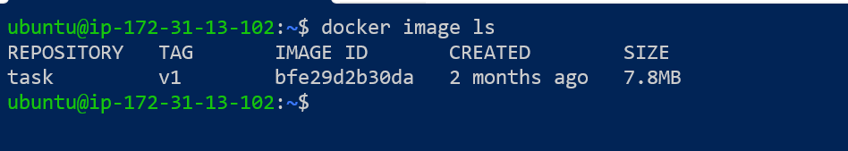
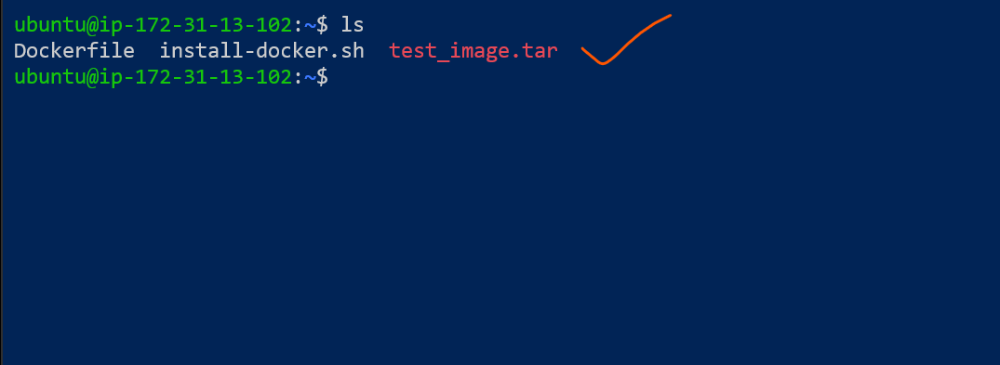
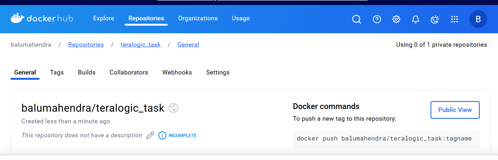
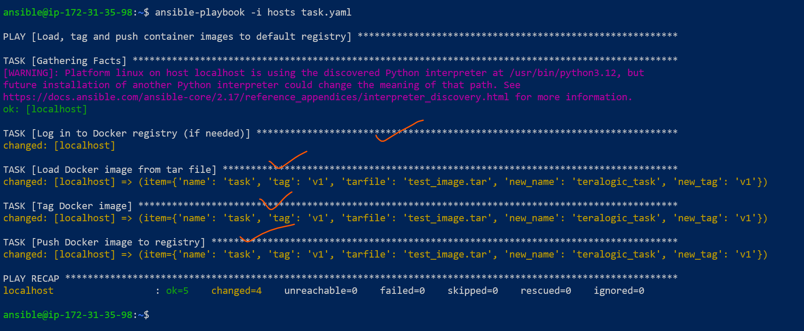
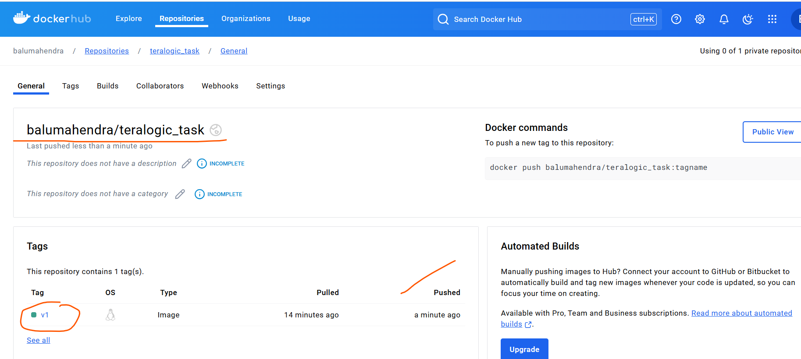

## docker image creation
------------------------------------------------------------------------------------------
* we need to install docker in the server for the docker image build process.for that i was followed official docs of docker.
* after that i was added the user to docker group by using command,
```sh
sudo usermod -aG docker ubuntu
```
* i was created a sample docker file.
```Dockerfile
FROM alpine:latest # base image lightweight os
LABEL author=balu
CMD ["echo","hai, this is balu i am doing task"]  
```
* i was built a docker image by command,
```sh
docker image build -t task:v1 .
```
* to find the docker images we use the command,
```
docker image ls
```

* now we got a sample `dockerimage`.
* i created a tar field by using command,
```sh
docker save -o test_image.tar task:v1
```

## ansible paly book creation
-----------------------------------------------------------------------------------
* before that i was installed ansible from official docs [Refer Here](https://docs.ansible.com/ansible/latest/installation_guide/installation_distros.html#installing-ansible-on-ubuntu)
* i want to write a ansible playbook.
* i was created a invetory folder `hosts` and add the entry `localhost`.
* here i did a paaswordless authentication by using `ssh-keygen`.
* created a playbook with the name `task.yaml`.
```yaml
---
- name: Load, tag and push container images to default registry
  hosts: all
  become: yes
  vars:
    #registry_url: "https://hub.docker.com"
    registry_user: "balumahendra"  
    registry_password: "password"  
    images:
      - name: "task"
        tag: "v1"
        tarfile: "test_image.tar"
        new_name: "teralogic_task"
        new_tag: "v1"

  tasks:
    - name: Log in to Docker registry (if needed)
      command: docker login -u "{{ registry_user }}" -p "{{ registry_password }}" 
      ignore_errors: yes  # Ignore errors if already logged in

    - name: Load Docker image from tar file
      command: docker load -i "{{ item.tarfile }}"
      loop: "{{ images }}"
      register: load_result

    - name: Tag Docker image
      command: docker tag "{{ item.name }}:{{ item.tag }}" "{{ registry_user }}/{{ item.new_name }}:{{ item.new_tag }}"
      loop: "{{ images }}"
      when: load_result is succeeded

    - name: Push Docker image to registry
      command: docker push "{{ registry_user }}/{{ item.new_name }}:{{ item.new_tag }}"
      loop: "{{ images }}"
      when: load_result is succeeded
```
* i have loged into my dockerhub account and created a new repository.

* to execte the playbook in used the the command
```
ansible-playbook -i hosts task.yaml 
```

* it will successfully pushed to dockerhub.


# Task completed
# `Thank you`


